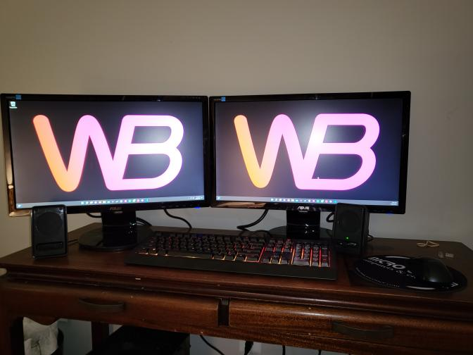

After many years of using TVs and a square monitor, I finally have a proper setup!

Great, right? You can only go so long envying others for something that's arguably essential. Example of why: testing this website. Code on one screen, website reflects updates through browser on the other. Life is easier that way. It's like doubling the size of your work shed.

That's all for this post. Short and sweet. Will post more soon.